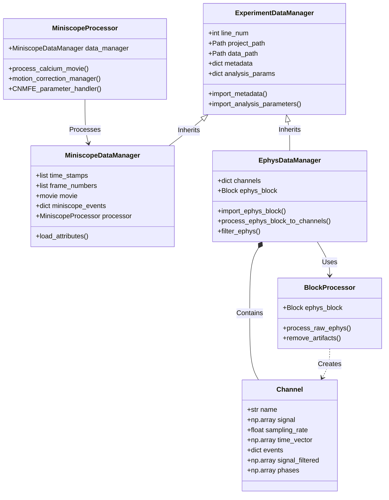

# ACE-NeuroTools: Analysis of Calcium Imaging and Electrophysiology

## Local research workbench

The independent [GUI in `gui/`](gui/README.md) provides a VS Code-inspired
research workspace built with Lumino, Monaco Editor and Codicons, using viridis
colors. It connects to the existing EVC backend for parameter editing,
revision recording/comparison, comments, safe recovery and result verification.
See the [development audit](gui/docs/AUDIT.md) and
[remaining scientific/product issues](gui/docs/KNOWN_ISSUES.md).
Scientific pipeline execution remains available through the existing CLI.

## Comenius planning

The `proj-comenius` branch plans a human-first GUI workflow, recoverable experiment history, and modular multimodal analysis. Start with the [shared roadmap and feature issues](https://github.com/emelon8/experiment_analysis/issues/69), the [planning overview](docs/comenius/README.md), and the [open decision register](docs/comenius/decisions.md). Those documents describe the wider proposed workflow. The `gui/` workbench implements the local EVC interaction subset; run orchestration, curation integration and cloud sharing remain separate work.

**A comprehensive, open-source data analysis pipeline for systems neuroscience.**

This software facilitates the processing, analysis, and visualization of simultaneous calcium imaging (Miniscope) and electrophysiology (EEG/LFP) data. It provides a modular and extensible framework for handling complex multimodal datasets through the Python API, command-line pipelines, and a local experiment GUI.

## Key Features

*   **Miniscope Processing:** End-to-end pipeline for 1-photon calcium imaging data, incorporating:
    *   Preprocessing: Cropping, detrending, and $\Delta F/F$ normalization.
    *   Motion Correction: Rigid and non-rigid registration.
    *   Source Extraction: Implementation of Constrained Nonnegative Matrix Factorization for micro-Endoscopic data (CNMF-E).
    *   Event Detection: Robust inference of calcium events from temporal traces.
*   **Electrophysiology Analysis:** Tools for importing and cleaning Neuralynx data, including artifact removal, filtering, phase computation, and spectral analysis.
*   **Multimodal Integration:** Seamless alignment of independent Miniscope and Ephys timestamps, enabling cross-modal analysis such as phase-locking of calcium events to channel-specific oscillations.
*   **Data Management:** Integrated utilities for managing large experiment cohorts with explicit path management and automated cloud storage (Box) interaction.
*   **Development Tools:** Type annotations, an API documentation site, and automated tests.

## Experiment GUI

Open existing `experiments.csv` and `analysis_parameters.csv` in a minimal local
GUI. Browse projects, click an experiment row, and edit clearly labeled metadata
and analysis settings. System file dialogs open projects and select recording folders;
missing settings identify each affected experiment. Saves update the existing CSVs
through the tool’s write helpers, with backups and checks for external edits.

Search for **ACE Experiments** in the application menu on this computer, or run
from this checkout:

```bash
./launch-gui
```

The launcher searches for an existing CaImAn environment and opens the repository's
`data` project when present. Use `./launch-gui --project /path/to/project` or choose
**Open project** in the GUI. Run `./launch-gui --check` to check the environment
without starting the server. It does not install dependencies.
The wrapper also provides guided Box authentication, embedded crop editing, and
reviewed analysis runs with preserved per-run inputs and results. Box setup is shared
across projects; missing recordings open a file selection and size review before
you confirm a download to the configured location. Downloads can be cancelled, and
small test selections are reused for cropping and analysis. Embedded neuron review
loads real CNMF estimates, displays footprints and traces, saves keep/reject
decisions, preselects the newest estimates, and exports named curated HDF5/NPZ
copies without replacing the source.

In **Neurons → Finish review**, **Save curated copies & detect events** reruns the
calcium-event detector on kept neurons and writes a new `calcium-events.json` with
original component IDs and provenance. Saving curated copies alone does not update
events. The extraction run still detects events before embedded neuron review;
earlier results remain tied to that run. Ephys and multimodal results need separate
runs.

CNMF-E setup and run review show the output location. **Results → Output inventory**
reports exported events, component IDs, traces/footprints, raw and filtered signals,
and available diagnostics, with reasons for missing outputs. GUI runs preserve inputs
and outputs under `<project>/.ace-runs/<run-id>/`; curations use separate folders.
No Node.js or frontend build is needed. See the [experiment GUI guide](docs/guides/experiment_gui.md)
and [GUI reference](gui/README.md) for launch, review, output, and error details.

## System Architecture

The project is built on a robust object-oriented framework designed for scalability and reproducibility:



### Core Data Classes
*   **`ExperimentDataManager`**: Base class for managing experiment metadata and analysis parameters.
*   **`MiniscopeDataManager`**: Specialized handler for calcium imaging data, managing video streams, timestamps, and CNMF-E results.
*   **`EphysDataManager`**: Specialized handler for electrophysiology data, managing raw Block imports and channel signal processing.

### Processing Classes
*   **`MiniscopeProcessor`**: Orchestrates the calcium imaging workflow, wrapping `CaImAn` functionality with optimized defaults and parallel processing management.
*   **`BlockProcessor`**: Handles signal conditioning and artifact removal for electrophysiological data.

## Installation

1. **Prerequisites**: Python 3.10+, Mamba/Conda.
2. **Clone & Install**:
   ```bash
   git clone https://github.com/emelon8/experiment_analysis.git
   cd experiment_analysis
   mamba env create -f linux_environment.yml
   conda activate caiman
   pip install -e .
   ```
3. **Configure Paths**: Use `--project-path` CLI arguments or pass paths to `Pipeline.run()` (see below).

### Project Setup

For the individual pipelines, supply project and recording paths explicitly:

1.  **CLI Arguments**: Use `--project-path` and `--data-path` when running scripts.
2.  **Programmatic API**: Pass paths directly to the `Pipeline.run()` method.

```python
from aceneurotools.pipelines.ephys import EphysPipeline

api = EphysPipeline()
api.run(line_num=96, project_path="/path/to/project", data_path="/path/to/raw_data")
```

For more details on directory structure and cloud integration, see the **[Getting Started guide on Read the Docs](https://aceneurotools.readthedocs.io/en/latest/getting_started/)** (source: [`docs/getting_started.md`](docs/getting_started.md)).

## Usage

The individual pipeline CLIs merge their defaults with supported values from
`analysis_parameters.csv`, then apply CLI paths and headless policy. A direct Python
`run(...)` call uses the method's defaults and supplied arguments; load and merge CSV
run settings explicitly when needed. Managers still read CSV metadata, crop coordinates,
and scientific CaImAn settings. See [parameter precedence](docs/getting_started.md#3a-passing-parameters-into-the-pipelines).

`MiniscopePipeline.run()` defaults to `run_CNMFE=False` and `inline=False`;
the Miniscope module CLI and GUI CNMF-E mode default to `run_CNMFE=True` and
`inline=True`. Set these explicitly when comparing entry points.

### 1. Miniscope Analysis
**Entry point:** `python -m aceneurotools.pipelines.miniscope` (implementation under `src/aceneurotools/pipelines/miniscope.py`).

```bash
# Run analysis for experiment line 96
python -m aceneurotools.pipelines.miniscope --line-num 96 --project-path /path/to/project --data-path /path/to/raw_data

# Run in headless mode (e.g., for HPC/Slurm jobs)
python -m aceneurotools.pipelines.miniscope --line-num 96 --project-path /path/to/project --data-path /path/to/raw_data --headless
```

### 2. Electrophysiology Analysis
**Entry point:** `python -m aceneurotools.pipelines.ephys` (implementation under `src/aceneurotools/pipelines/ephys.py`).

```bash
python -m aceneurotools.pipelines.ephys --line-num 96 --project-path /path/to/project --data-path /path/to/raw_data
```

### 3. Multimodal Analysis
**Entry point:** `python -m aceneurotools.pipelines.multimodal` (implementation under `src/aceneurotools/pipelines/multimodal.py`).

```bash
python -m aceneurotools.pipelines.multimodal --line-num 97 --project-path /path/to/project --data-path /path/to/raw_data
```

Headless mode suppresses interactive steps and respects `inline`. When filtering
runs, `inline=True` replaces the final temporal projection with filtered data;
`inline=False` keeps the unfiltered projection. Earlier headless versions forced
`inline=False`; specify it explicitly to preserve that behavior. Calcium events use
component traces `C`, and phases/spectra are computed before projection filtering.

For detailed documentation, see the user guides: [Miniscope](docs/guides/miniscope.md), [Ephys](docs/guides/ephys.md), and [Multimodal](docs/guides/multimodal.md) (also published on [Read the Docs](https://aceneurotools.readthedocs.io/en/latest/)).

## Documentation

A comprehensive documentation site, including full API references and guides, is available at:
**[https://aceneurotools.readthedocs.io/en/latest/](https://aceneurotools.readthedocs.io/en/latest/)**

To view the documentation locally:
```bash
pip install -e ".[docs]"
bash scripts/sync_notebooks_for_docs.sh
mkdocs serve
```

## Examples

Check the `examples/` directory for demonstration scripts:
*   **[explicit_paths_demo.py](examples/explicit_paths_demo.py)**: Shows how to run pipelines using the explicit path API.

## Development and testing

### Test fixtures

- **`tests/data/sample_recording/`** — Small committed recordings used by **autodetect** tests (`MiniscopeDataManager.create` / `EphysDataManager.create` routing) and by the **slow** Miniscope CNMF-E end-to-end test. A normal clone includes this tree; do not remove it if you want those tests to run.
- **Regenerating fixtures** — If you have the full raw `sample data/` folders at the project root (not required for most contributors), run [`scripts/create_test_data.py`](scripts/create_test_data.py) to rebuild truncated UCLA miniscope + Neuralynx ephys fixtures from those sources.

### Running tests

```bash
pip install -e ".[dev]"
# Default: fast tests (excludes slow CNMF-E full pipeline)
pytest tests/ -m "not slow"
# Full suite including Miniscope CNMF-E e2e on sample data
pytest tests/
```

You can configure CI (e.g. GitHub Actions) to run `pytest tests/ -m "not slow"` on every push or PR; add a separate job or manual workflow if you want the full **slow** Miniscope CNMF-E suite on release branches.

## License

ACE-NeuroTools is licensed under the **GNU General Public License version 3 (or later)** (`GPL-3.0-or-later`). See [`LICENSE`](LICENSE).

This project depends on [CaImAn](https://github.com/flatironinstitute/CaImAn) at runtime. CaImAn’s upstream license notice permits use under **GPLv2 or any later version**; ACE-NeuroTools exercises that option and distributes under GPL-3.0-or-later for improved ecosystem license compatibility.
