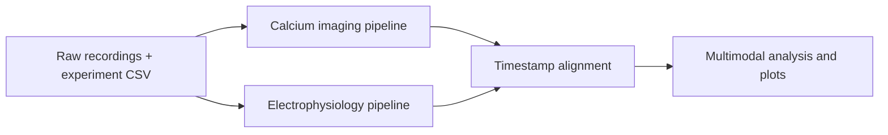
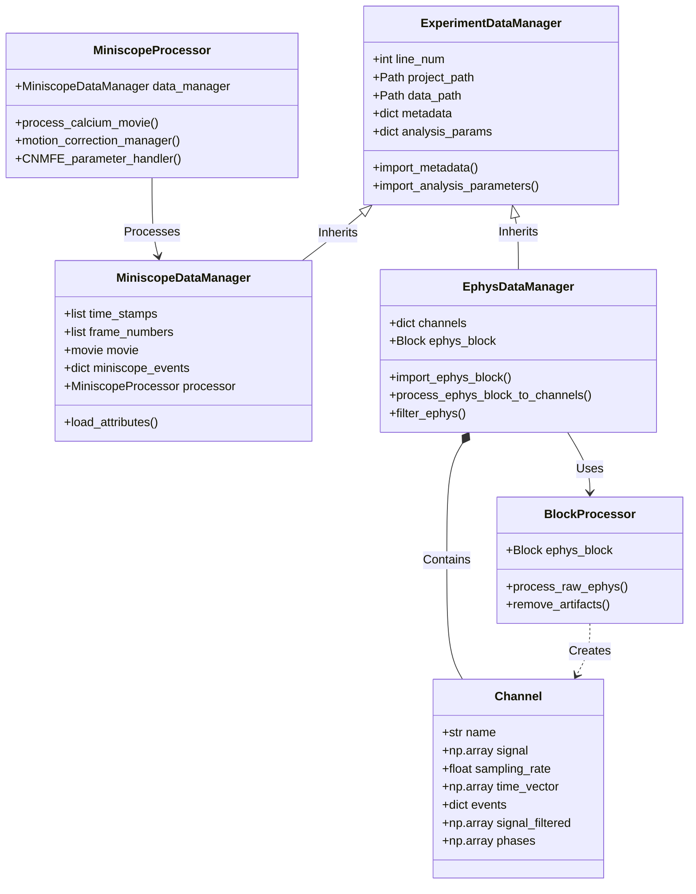

# ACE-NeuroTools: Analysis of Calcium Imaging and Electrophysiology

**Tools for turning miniscope videos and brain-signal recordings into analysis results.**

A miniscope records video of activity in groups of cells. Electrophysiology records electrical signals from named channels. ACE-NeuroTools reads these recordings, processes each type, and can align their times when they were recorded together. It needs an experiment list (`experiments.csv`) and the raw files from your lab. Start with the [Getting Started guide](docs/getting_started.md) for a recording-to-result walkthrough. For citation metadata, see [`CITATION.cff`](CITATION.cff). Include the version or commit used in your analysis; the companion paper and an archived release DOI have not yet been added.

The [plain-language terms](docs/glossary.md) page defines the recording and processing terms used throughout the guides.

## What it does

| Workflow | Inputs | Processing and results |
| --- | --- | --- |
| Calcium imaging | Miniscope movies, metadata, and timestamps | Crop and normalize movies, correct motion, extract cell signals with CaImAn CNMF-E, and infer calcium events. |
| Electrophysiology | Neuralynx or RHS2116/ONIX recordings | Import channels, remove artifacts where supported, filter signals, and compute phase or spectral summaries. |
| Multimodal analysis | Paired imaging and electrical recordings with synchronization information | Align timestamps using TTL pulses or the shared ONIX clock, then compare calcium events with electrical activity. |

Processing steps depend on the selected options and recording format. See the
[output map](docs/getting_started.md) and modality guides for what each run saves.
Experiment metadata lives in CSV files; Box downloads are optional.



## Project status

ACE-NeuroTools is research software in **alpha**. The automated suite uses
synthetic inputs and component tests; a complete analysis of a real recording
is not part of CI. The locked environment covers Linux and Windows. macOS
has not been locked or QA-tested. Validate your recording format and results
before using them in a scientific report.

Start with [Getting started](docs/getting_started.md), explore the
[examples](docs/examples.md), or read the
[contributor guide](CONTRIBUTING.md) to develop the package.

## Experiment GUI

Open existing `experiments.csv` and `analysis_parameters.csv` in a minimal local
GUI. Browse projects, click an experiment row, and edit clearly labeled metadata
and analysis settings. System file dialogs open projects and select recording folders;
missing settings identify each affected experiment. Saves update the existing CSVs
through the tool’s write helpers, with backups and checks for external edits.

Search for **ACE Experiments** in the application menu on this computer, or run
from this checkout:

```bash
./launch-gui
```

The launcher searches for an existing CaImAn environment and opens the repository's
`data` project when present. Use `./launch-gui --project /path/to/project` or choose
**Open project** in the GUI. Run `./launch-gui --check` to check the environment
without starting the server. It does not install dependencies.
The wrapper also provides guided Box authentication, embedded crop editing, and
reviewed analysis runs with preserved per-run inputs and results. Box setup is shared
across projects; missing recordings open a file selection and size review before
you confirm a download to the configured location. Downloads can be cancelled, and
small test selections are reused for cropping and analysis. Embedded neuron review
loads real CNMF estimates, displays footprints and traces, saves keep/reject
decisions, preselects the newest estimates, and exports named curated HDF5/NPZ
copies without replacing the source.

In **Neurons → Finish review**, **Save curated copies & detect events** reruns the
calcium-event detector on kept neurons and writes a new `calcium-events.json` with
original component IDs and provenance. Saving curated copies alone does not update
events. The extraction run still detects events before embedded neuron review;
earlier results remain tied to that run. Ephys and multimodal results need separate
runs.

CNMF-E setup and run review show the output location. **Results → Output inventory**
reports exported events, component IDs, traces/footprints, raw and filtered signals,
and available diagnostics, with reasons for missing outputs. GUI runs preserve inputs
and outputs under `<project>/.ace-runs/<run-id>/`; curations use separate folders.
No Node.js or frontend build is needed. See the [experiment GUI guide](docs/guides/experiment_gui.md)
and [GUI reference](gui/README.md) for launch, review, output, and error details.


## Installation

1. **Prerequisites**: micromamba or mamba. The full application depends on the neuroscience CaImAn package from conda-forge; the similarly named project on PyPI is unrelated.
2. **Clone & Install**:
   ```bash
   git clone https://github.com/emelon8/ACE-NeuroTools.git
   cd ACE-NeuroTools
   micromamba create -n aceneurotools -f conda-lock.yml  # Linux or Windows
   micromamba activate aceneurotools
   pip install --no-deps -e .
   ```
3. **Prepare your data**: Run `python -m aceneurotools.init --project-path /path/to/project`, then copy its `experiments_template.csv` to `experiments.csv` in that folder. Replace the example row with one of your own recordings: enter a unique `line number`, the relevant recording directory, and the actual ephys channel name when running ephys. Leave Box folder IDs blank when your files are already local. Note the folder containing your raw recordings. The [Getting Started guide](docs/getting_started.md) explains the CSV columns and folder layout.

### Project Setup

For a predictable run, provide both paths explicitly:

1.  **CLI Arguments**: Use `--project-path` and `--data-path` when running scripts.
2.  **Programmatic API**: Pass paths directly to the `Pipeline.run()` method.

```python
from aceneurotools.pipelines.ephys import EphysPipeline

api = EphysPipeline()
api.run(
    line_num=96,
    project_path="/path/to/project",
    data_path="/path/to/raw_data",
)
```

For directory structure and cloud integration, see the [Getting started guide](docs/getting_started.md).

## Usage

Direct `MiniscopePipeline.run()` calls default to `run_CNMFE=False` and `inline=False`.
The miniscope CLI and GUI enable extraction by default and use `inline=True`.
Headless mode preserves the requested filtering behavior. See the
[pipeline reference](docs/api/pipelines.md) for defaults and signal provenance.

Replace `/path/to/project` with the folder containing `experiments.csv`, `/path/to/raw_data` with the root of your raw recordings, and `96` or `97` with a value in the CSV's `line number` column. The module commands combine their defaults with recognized values from an optional `analysis_parameters.csv`. Direct Python `run(...)` calls use the arguments you pass and their method defaults; they do not automatically merge CSV settings.

For example, if `/path/to/raw_data/Rat01/session1/Miniscope/0.avi` contains a UCLA V3 recording with its metadata and timestamps, set `line number` to `96` and `calcium imaging directory` to `Rat01/session1` in that row of `experiments.csv`. The miniscope command below then selects that row and looks under the raw-data root. Replace these example values with your own recording before running it.

For a miniscope run with CNMF-E enabled, look for `saved_movies/estimates.hdf5` inside the recording's calcium-imaging directory after processing. This file appears only when source extraction succeeds and estimates are saved. See the [miniscope guide](docs/guides/miniscope.md) for those options.

### 1. Miniscope Analysis
**Entry point:** `python -m aceneurotools.pipelines.miniscope` (implementation under `src/aceneurotools/pipelines/miniscope.py`).

```bash
# Run analysis for experiment ID 96
python -m aceneurotools.pipelines.miniscope --line-num 96 --project-path /path/to/project --data-path /path/to/raw_data

# Run in headless mode (e.g., for HPC/Slurm jobs)
python -m aceneurotools.pipelines.miniscope --line-num 96 --project-path /path/to/project --data-path /path/to/raw_data --headless
```

### 2. Electrophysiology Analysis
**Entry point:** `python -m aceneurotools.pipelines.ephys` (implementation under `src/aceneurotools/pipelines/ephys.py`).

```bash
python -m aceneurotools.pipelines.ephys --line-num 96 --project-path /path/to/project --data-path /path/to/raw_data
```

### 3. Multimodal Analysis
**Entry point:** `python -m aceneurotools.pipelines.multimodal` (implementation under `src/aceneurotools/pipelines/multimodal.py`).

```bash
python -m aceneurotools.pipelines.multimodal --line-num 97 --project-path /path/to/project --data-path /path/to/raw_data
```

For detailed documentation, see the user guides: [Miniscope](docs/guides/miniscope.md), [Ephys](docs/guides/ephys.md), and [Multimodal](docs/guides/multimodal.md).

## Documentation

The [documentation index](docs/index.md) links to setup instructions, modality
guides, tutorials, and API reference sources. The previously advertised Read
the Docs address is unavailable; use the repository documentation until a
hosted site is configured and verified.

To preview the documentation locally, follow the complete [documentation preview instructions](docs/deployment.md). They install the documentation dependencies and copy tutorial notebooks into the docs tree before starting MkDocs.

## Examples

Check the `examples/` directory for demonstration scripts:
*   **[explicit_paths_demo.py](examples/explicit_paths_demo.py)**: Shows how to run pipelines using the explicit path API.

## Development and testing

### Test fixtures

Most tests generate small synthetic inputs; no raw recording dataset is bundled.
[`scripts/create_test_data.py`](scripts/create_test_data.py) is an unimplemented
fixture-generation hook. See the [contributor guide](CONTRIBUTING.md) for checks
and guidance on adding recording fixtures.

### Running tests

```bash
micromamba create -n aceneurotools -f conda-lock.yml  # Linux or Windows
micromamba activate aceneurotools
pip install --no-deps -e .
# Run the committed test suite
pytest tests/ -m "not slow"
```

CI requires this test selection, lint and format checks, a strict documentation build, and distribution validation on pushes and pull requests targeting `main`. A real-recording CNMF-E end-to-end test is not currently included; validate a representative recording locally before a scientific release.

### Reproducible environments

`environment.yml` is the single human-maintained environment specification. The committed `conda-lock.yml` currently covers Linux and Windows; macOS has not been locked or QA-tested. Generate additional platform resolutions before claiming macOS release support:

```bash
conda-lock lock --micromamba -f environment.yml \
  -p linux-64 -p win-64 -p osx-64 -p osx-arm64
```

Commit the generated `conda-lock.yml`. Archive it with the ACE-NeuroTools Git tag, analysis configuration, and input-data checksums for each paper release.

## System Architecture

This section is for developers extending the Python code. It shows how experiment managers and processing classes relate:



### Core Data Classes
*   **`ExperimentDataManager`**: Base class for managing experiment metadata and analysis parameters.
*   **`MiniscopeDataManager`**: Specialized handler for calcium imaging data, managing video streams, timestamps, and CNMF-E results.
*   **`EphysDataManager`**: Specialized handler for electrophysiology data, managing raw Block imports and channel signal processing.

### Processing Classes
*   **`MiniscopeProcessor`**: Orchestrates the calcium imaging workflow, wrapping `CaImAn` functionality with optimized defaults and parallel processing management.
*   **`BlockProcessor`**: Handles signal conditioning and artifact removal for electrophysiological data.

## License

ACE-NeuroTools is licensed under the **GNU General Public License version 3 (or later)** (`GPL-3.0-or-later`). See [`LICENSE`](LICENSE).

Maintainers should follow the [release checklist](docs/releasing.md) to publish a validated package and archive a paper-ready software release.

This project depends on [CaImAn](https://github.com/flatironinstitute/CaImAn) at runtime. CaImAn’s upstream license notice permits use under **GPLv2 or any later version**; ACE-NeuroTools exercises that option and distributes under GPL-3.0-or-later for improved ecosystem license compatibility.
