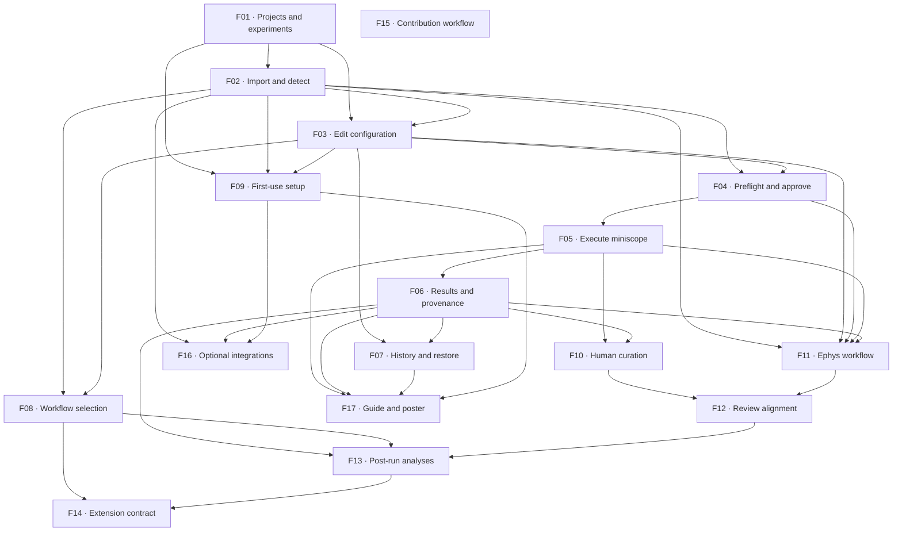

# Feature backlog

**Shared roadmap:** [https://github.com/emelon8/experiment_analysis/issues/69](https://github.com/emelon8/experiment_analysis/issues/69)

All features are proposals awaiting their listed human decisions. Completion dependencies are recorded below and in GitHub. Ownership roles are suggestions; every new issue is initially unassigned.

A blocker governs completion/integration, not whether useful design or fixture work can begin. Claim the issue before coding; coordinate changes to shared contracts in their owning issue.

## Numbered breakdown

1. **[F01 — Create and reopen projects and experiments through GUI and CLI](https://github.com/emelon8/experiment_analysis/issues/70)**
   - **Blocked by:** None.
   - **User story:** Deliver the first small application path: a researcher creates a project and experiment in the GUI, closes the application, reopens the same workspace, and inspects the same saved identity through the CLI. Define the shared application contract through this working slice.
   - **Decision gates:** [D01](https://github.com/emelon8/experiment_analysis/issues/87), [D02](https://github.com/emelon8/experiment_analysis/issues/88), [D03](https://github.com/emelon8/experiment_analysis/issues/89), [D04](https://github.com/emelon8/experiment_analysis/issues/90), [D05](https://github.com/emelon8/experiment_analysis/issues/91), [D06](https://github.com/emelon8/experiment_analysis/issues/92), [D18](https://github.com/emelon8/experiment_analysis/issues/104), [D20](https://github.com/emelon8/experiment_analysis/issues/106), [D21](https://github.com/emelon8/experiment_analysis/issues/107).
   - **Proposed owner role:** Application + UX owner. **Stage:** First path.
   - [Full acceptance criteria](issues/f01.md).

2. **[F02 — Import recordings with explainable format detection and human confirmation](https://github.com/emelon8/experiment_analysis/issues/71)**
   - **Blocked by:** [F01](https://github.com/emelon8/experiment_analysis/issues/70).
   - **User story:** Attach one supported recording to an existing experiment. Present detected modality/format, relevant metadata, and evidence, then let the researcher confirm or correct the choice before the input is recorded.
   - **Decision gates:** [D06](https://github.com/emelon8/experiment_analysis/issues/92), [D08](https://github.com/emelon8/experiment_analysis/issues/94), [D09](https://github.com/emelon8/experiment_analysis/issues/95), [D10](https://github.com/emelon8/experiment_analysis/issues/96).
   - **Proposed owner role:** Data reader + UX owner. **Stage:** First path.
   - [Full acceptance criteria](issues/f02.md).

3. **[F03 — Edit experiment and pipeline settings in the GUI with a migration path](https://github.com/emelon8/experiment_analysis/issues/72)**
   - **Blocked by:** [F01](https://github.com/emelon8/experiment_analysis/issues/70), [F02](https://github.com/emelon8/experiment_analysis/issues/71).
   - **User story:** Load an existing supported CSV/JSON configuration or a new experiment, edit meaningful processing parameters in a form, save a named revision, and use the same effective settings from the CLI.
   - **Decision gates:** [D02](https://github.com/emelon8/experiment_analysis/issues/88), [D05](https://github.com/emelon8/experiment_analysis/issues/91), [D07](https://github.com/emelon8/experiment_analysis/issues/93), [D11](https://github.com/emelon8/experiment_analysis/issues/97), [D18](https://github.com/emelon8/experiment_analysis/issues/104).
   - **Proposed owner role:** Configuration + UX owner. **Stage:** First path.
   - [Full acceptance criteria](issues/f03.md).

4. **[F04 — Preflight a run and approve its exact inputs and settings](https://github.com/emelon8/experiment_analysis/issues/73)**
   - **Blocked by:** [F02](https://github.com/emelon8/experiment_analysis/issues/71), [F03](https://github.com/emelon8/experiment_analysis/issues/72).
   - **User story:** Prepare an inspectable run plan from a saved configuration, perform bounded checks, and require human approval of that plan before dispatch. Offer equivalent structured preflight results and explicit approval behavior for CLI use.
   - **Decision gates:** [D08](https://github.com/emelon8/experiment_analysis/issues/94), [D09](https://github.com/emelon8/experiment_analysis/issues/95), [D12](https://github.com/emelon8/experiment_analysis/issues/98).
   - **Proposed owner role:** Execution + scientific workflow owner. **Stage:** First path.
   - [Full acceptance criteria](issues/f04.md).

5. **[F05 — Run miniscope processing with progress, cancellation, and durable outcomes](https://github.com/emelon8/experiment_analysis/issues/74)**
   - **Blocked by:** [F04](https://github.com/emelon8/experiment_analysis/issues/73).
   - **User story:** Execute one approved miniscope run using the existing processing pipeline while keeping the interface responsive. Show progress and actionable failures, retain the run record, and let a researcher deliberately cancel or retry.
   - **Decision gates:** [D04](https://github.com/emelon8/experiment_analysis/issues/90), [D08](https://github.com/emelon8/experiment_analysis/issues/94), [D09](https://github.com/emelon8/experiment_analysis/issues/95), [D12](https://github.com/emelon8/experiment_analysis/issues/98), [D13](https://github.com/emelon8/experiment_analysis/issues/99).
   - **Proposed owner role:** Execution owner. **Stage:** First path.
   - [Full acceptance criteria](issues/f05.md).

6. **[F06 — Browse experiment results with provenance and a shareable export](https://github.com/emelon8/experiment_analysis/issues/75)**
   - **Blocked by:** [F05](https://github.com/emelon8/experiment_analysis/issues/74).
   - **User story:** After a run, browse outputs from its experiment, open an artifact, inspect what produced it, and export an explicitly selected result bundle for a collaborator.
   - **Decision gates:** [D06](https://github.com/emelon8/experiment_analysis/issues/92), [D08](https://github.com/emelon8/experiment_analysis/issues/94), [D15](https://github.com/emelon8/experiment_analysis/issues/101), [D18](https://github.com/emelon8/experiment_analysis/issues/104), [D19](https://github.com/emelon8/experiment_analysis/issues/105).
   - **Proposed owner role:** Results + provenance owner. **Stage:** First path.
   - [Full acceptance criteria](issues/f06.md).

7. **[F07 — Compare experiment revisions and restore settings without losing history](https://github.com/emelon8/experiment_analysis/issues/76)**
   - **Blocked by:** [F03](https://github.com/emelon8/experiment_analysis/issues/72), [F06](https://github.com/emelon8/experiment_analysis/issues/75).
   - **User story:** Let a researcher see saved revisions, compare meaningful settings, and restore an older configuration into a new revision while keeping existing runs traceable.
   - **Decision gates:** [D07](https://github.com/emelon8/experiment_analysis/issues/93), [D08](https://github.com/emelon8/experiment_analysis/issues/94), [D18](https://github.com/emelon8/experiment_analysis/issues/104).
   - **Proposed owner role:** History + provenance owner. **Stage:** Trust and usability.
   - [Full acceptance criteria](issues/f07.md).

8. **[F08 — Choose processing modules and review contextual workflow suggestions](https://github.com/emelon8/experiment_analysis/issues/77)**
   - **Blocked by:** [F02](https://github.com/emelon8/experiment_analysis/issues/71), [F03](https://github.com/emelon8/experiment_analysis/issues/72).
   - **User story:** Present compatible processing/analysis choices for confirmed recordings, explain why a template or module is suggested, and save the researcher’s chosen workflow.
   - **Decision gates:** [D09](https://github.com/emelon8/experiment_analysis/issues/95), [D11](https://github.com/emelon8/experiment_analysis/issues/97), [D15](https://github.com/emelon8/experiment_analysis/issues/101), [D16](https://github.com/emelon8/experiment_analysis/issues/102).
   - **Proposed owner role:** Workflow + UX owner. **Stage:** Trust and usability.
   - [Full acceptance criteria](issues/f08.md).

9. **[F09 — Guide first-time users through setup and a representative example](https://github.com/emelon8/experiment_analysis/issues/78)**
   - **Blocked by:** [F01](https://github.com/emelon8/experiment_analysis/issues/70), [F02](https://github.com/emelon8/experiment_analysis/issues/71), [F03](https://github.com/emelon8/experiment_analysis/issues/72).
   - **User story:** Guide a new researcher from installation/launch to a configured example project, with dependency checks, clear explanations, and a path to use their own recording.
   - **Decision gates:** [D01](https://github.com/emelon8/experiment_analysis/issues/87), [D04](https://github.com/emelon8/experiment_analysis/issues/90), [D10](https://github.com/emelon8/experiment_analysis/issues/96), [D19](https://github.com/emelon8/experiment_analysis/issues/105), [D20](https://github.com/emelon8/experiment_analysis/issues/106).
   - **Proposed owner role:** Onboarding + documentation owner. **Stage:** First path.
   - [Full acceptance criteria](issues/f09.md).

10. **[F10 — Integrate existing scientific curation with recorded decisions and preserved estimates](https://github.com/emelon8/experiment_analysis/issues/79)**
   - **Blocked by:** [F05](https://github.com/emelon8/experiment_analysis/issues/74), [F06](https://github.com/emelon8/experiment_analysis/issues/75).
   - **User story:** Connect existing crop/component-review tools to the Comenius run/result workflow. Preserve the original estimates and make each researcher’s accepted curation traceable to a specific artifact.
   - **Decision gates:** [D07](https://github.com/emelon8/experiment_analysis/issues/93), [D09](https://github.com/emelon8/experiment_analysis/issues/95), [D13](https://github.com/emelon8/experiment_analysis/issues/99), [D21](https://github.com/emelon8/experiment_analysis/issues/107).
   - **Proposed owner role:** Curation integration owner, coordinated with PR #68. **Stage:** Trust and usability.
   - [Full acceptance criteria](issues/f10.md).

11. **[F11 — Configure and run an ephys experiment through the shared workflow](https://github.com/emelon8/experiment_analysis/issues/80)**
   - **Blocked by:** [F02](https://github.com/emelon8/experiment_analysis/issues/71), [F03](https://github.com/emelon8/experiment_analysis/issues/72), [F04](https://github.com/emelon8/experiment_analysis/issues/73), [F05](https://github.com/emelon8/experiment_analysis/issues/74), [F06](https://github.com/emelon8/experiment_analysis/issues/75).
   - **User story:** Use the common import, settings, preflight, execution, and results flow for one nominated electrophysiology recording and channel.
   - **Decision gates:** [D10](https://github.com/emelon8/experiment_analysis/issues/96), [D12](https://github.com/emelon8/experiment_analysis/issues/98), [D13](https://github.com/emelon8/experiment_analysis/issues/99), [D14](https://github.com/emelon8/experiment_analysis/issues/100).
   - **Proposed owner role:** Ephys workflow owner. **Stage:** Multimodal.
   - [Full acceptance criteria](issues/f11.md).

12. **[F12 — Align paired calcium and ephys recordings with visible synchronization review](https://github.com/emelon8/experiment_analysis/issues/81)**
   - **Blocked by:** [F10](https://github.com/emelon8/experiment_analysis/issues/79), [F11](https://github.com/emelon8/experiment_analysis/issues/80).
   - **User story:** Pair two recordings in an experiment, align them using the existing synchronization capabilities, show quality and uncertain periods, and save the reviewed mapping for downstream analysis.
   - **Decision gates:** [D02](https://github.com/emelon8/experiment_analysis/issues/88), [D08](https://github.com/emelon8/experiment_analysis/issues/94), [D09](https://github.com/emelon8/experiment_analysis/issues/95), [D13](https://github.com/emelon8/experiment_analysis/issues/99), [D14](https://github.com/emelon8/experiment_analysis/issues/100).
   - **Proposed owner role:** Synchronization + scientific review owner. **Stage:** Multimodal.
   - [Full acceptance criteria](issues/f12.md).

13. **[F13 — Run opt-in post-processing analyses and inspect traceable figures and tables](https://github.com/emelon8/experiment_analysis/issues/82)**
   - **Blocked by:** [F06](https://github.com/emelon8/experiment_analysis/issues/75), [F08](https://github.com/emelon8/experiment_analysis/issues/77), [F12](https://github.com/emelon8/experiment_analysis/issues/81).
   - **User story:** After reviewed processing/alignment, let a researcher select a small agreed set of existing analyses, review inputs/settings, execute them, and inspect/export linked results.
   - **Decision gates:** [D08](https://github.com/emelon8/experiment_analysis/issues/94), [D14](https://github.com/emelon8/experiment_analysis/issues/100), [D15](https://github.com/emelon8/experiment_analysis/issues/101).
   - **Proposed owner role:** Analysis workflow owner. **Stage:** Multimodal.
   - [Full acceptance criteria](issues/f13.md).

14. **[F14 — Add a community reader or analysis module through a documented extension contract](https://github.com/emelon8/experiment_analysis/issues/83)**
   - **Blocked by:** [F08](https://github.com/emelon8/experiment_analysis/issues/77), [F13](https://github.com/emelon8/experiment_analysis/issues/82).
   - **User story:** Prove extensibility with one reference module that declares its inputs, settings, checks, execution, and outputs and becomes usable in both GUI and CLI without modifying either interface.
   - **Decision gates:** [D04](https://github.com/emelon8/experiment_analysis/issues/90), [D08](https://github.com/emelon8/experiment_analysis/issues/94), [D11](https://github.com/emelon8/experiment_analysis/issues/97), [D16](https://github.com/emelon8/experiment_analysis/issues/102), [D17](https://github.com/emelon8/experiment_analysis/issues/103).
   - **Proposed owner role:** Extension API owner. **Stage:** Community.
   - [Full acceptance criteria](issues/f14.md).

15. **[F15 — Document contribution, issue ownership, and human review workflows](https://github.com/emelon8/experiment_analysis/issues/84)**
   - **Blocked by:** None.
   - **User story:** Publish a contributor path that makes issue claiming, design decisions, module proposals, scientific review, and acceptance demonstrations understandable to a newcomer.
   - **Decision gates:** [D16](https://github.com/emelon8/experiment_analysis/issues/102), [D17](https://github.com/emelon8/experiment_analysis/issues/103), [D21](https://github.com/emelon8/experiment_analysis/issues/107).
   - **Proposed owner role:** Community documentation owner. **Stage:** Early / parallel.
   - [Full acceptance criteria](issues/f15.md).

16. **[F16 — Configure optional storage integrations with explicit transfer review](https://github.com/emelon8/experiment_analysis/issues/85)**
   - **Blocked by:** [F02](https://github.com/emelon8/experiment_analysis/issues/71), [F06](https://github.com/emelon8/experiment_analysis/issues/75), [F09](https://github.com/emelon8/experiment_analysis/issues/78).
   - **User story:** Allow a researcher to configure one approved existing storage integration, test its connection, choose files, inspect the planned transfer, and attach fetched inputs to the common import workflow.
   - **Decision gates:** [D06](https://github.com/emelon8/experiment_analysis/issues/92), [D08](https://github.com/emelon8/experiment_analysis/issues/94), [D09](https://github.com/emelon8/experiment_analysis/issues/95), [D19](https://github.com/emelon8/experiment_analysis/issues/105).
   - **Proposed owner role:** Integration owner. **Stage:** Community / optional.
   - [Full acceptance criteria](issues/f16.md).

17. **[F17 — Publish a tested workflow guide and poster-ready demonstration package](https://github.com/emelon8/experiment_analysis/issues/86)**
   - **Blocked by:** [F05](https://github.com/emelon8/experiment_analysis/issues/74), [F06](https://github.com/emelon8/experiment_analysis/issues/75), [F07](https://github.com/emelon8/experiment_analysis/issues/76), [F09](https://github.com/emelon8/experiment_analysis/issues/78).
   - **User story:** Create a shareable guide and demonstration package that shows the actual implemented Comenius journey, its human decision points, and one traceable result.
   - **Decision gates:** [D01](https://github.com/emelon8/experiment_analysis/issues/87), [D04](https://github.com/emelon8/experiment_analysis/issues/90), [D20](https://github.com/emelon8/experiment_analysis/issues/106), [D22](https://github.com/emelon8/experiment_analysis/issues/108).
   - **Proposed owner role:** Documentation + poster coordination owner. **Stage:** Checkpoint.
   - [Full acceptance criteria](issues/f17.md).

## Dependency overview

F10 also requires coordination with [PR #68](https://github.com/emelon8/experiment_analysis/pull/68). F15 can begin as contribution/process documentation before F14; its final extension example follows the accepted module contract.

## Discussion prompts

- Is each slice small enough for one accountable owner and an end-to-end demonstration?
- Are any dependencies unnecessary, or is a shared contract missing?
- Which features should be split/merged after D01 establishes the first milestone?
- Who will own each decision and review its scientific or usability acceptance?

## Publication record

The roadmap has 17 feature issues and 22 decision issues, all linked as native GitHub sub-issues. The 110 native blocking relationships include feature prerequisites and human decision gates. Issue bodies retain readable links. The verified relationship inventory is recorded in `github-relationships.json`.

## Decision issues

| Topic | Discussion |
| --- | --- |
| D01 — First milestone and audience | [#87](https://github.com/emelon8/experiment_analysis/issues/87) |
| D02 — Experiment, subject, session, and run | [#88](https://github.com/emelon8/experiment_analysis/issues/88) |
| D03 — GUI platform and application boundary | [#89](https://github.com/emelon8/experiment_analysis/issues/89) |
| D04 — Supported computers and installation | [#90](https://github.com/emelon8/experiment_analysis/issues/90) |
| D05 — Configuration authority and CSV migration | [#91](https://github.com/emelon8/experiment_analysis/issues/91) |
| D06 — Data layout and ownership | [#92](https://github.com/emelon8/experiment_analysis/issues/92) |
| D07 — History and recovery semantics | [#93](https://github.com/emelon8/experiment_analysis/issues/93) |
| D08 — Reproducibility contract | [#94](https://github.com/emelon8/experiment_analysis/issues/94) |
| D09 — Human approval and automation | [#95](https://github.com/emelon8/experiment_analysis/issues/95) |
| D10 — Detection scope and unsupported data | [#96](https://github.com/emelon8/experiment_analysis/issues/96) |
| D11 — Pipeline selection and suggestions | [#97](https://github.com/emelon8/experiment_analysis/issues/97) |
| D12 — Execution, resources, and interruption | [#98](https://github.com/emelon8/experiment_analysis/issues/98) |
| D13 — Scientific quality review and curation | [#99](https://github.com/emelon8/experiment_analysis/issues/99) |
| D14 — Multimodal alignment and scope | [#100](https://github.com/emelon8/experiment_analysis/issues/100) |
| D15 — Analysis, comparison, and export | [#101](https://github.com/emelon8/experiment_analysis/issues/101) |
| D16 — Module contracts and trust | [#102](https://github.com/emelon8/experiment_analysis/issues/102) |
| D17 — Contribution ownership and governance | [#103](https://github.com/emelon8/experiment_analysis/issues/103) |
| D18 — Experiment sharing and concurrent edits | [#104](https://github.com/emelon8/experiment_analysis/issues/104) |
| D19 — Integrations and external data movement | [#105](https://github.com/emelon8/experiment_analysis/issues/105) |
| D20 — Human usability and accessibility | [#106](https://github.com/emelon8/experiment_analysis/issues/106) |
| D21 — Branch strategy and compatibility promises | [#107](https://github.com/emelon8/experiment_analysis/issues/107) |
| D22 — Poster, documentation, and release evidence | [#108](https://github.com/emelon8/experiment_analysis/issues/108) |
