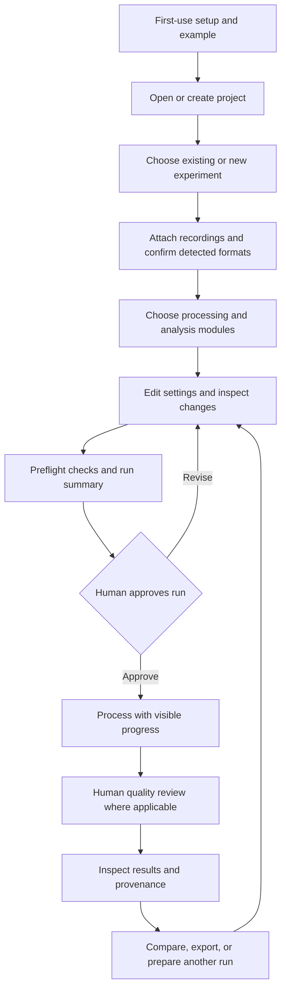

# Project Comenius

**A human-first workspace for configuring, running, reviewing, and sharing neuroscience experiments.**

Status: planning draft, 15 September 2026. Product directions below come from the supplied meeting transcript and project brief. Recommendations remain proposals until a human records a decision. The October 7 checkpoint has not yet been confirmed as an implementation deadline.

## Start here

- [Decision register](https://github.com/emelon8/experiment_analysis/blob/proj-comenius/docs/comenius/decisions.md): every identified choice, alternatives, recommendations, and affected work.
- [Feature backlog](https://github.com/emelon8/experiment_analysis/blob/proj-comenius/docs/comenius/backlog.md): independently claimable deliverables, dependencies, and GitHub links.
- [Meeting synthesis](https://github.com/emelon8/experiment_analysis/blob/proj-comenius/docs/comenius/meeting-synthesis.md): agreed direction, uncertainties, and current-code evidence.
- [Domain vocabulary](https://github.com/emelon8/experiment_analysis/blob/proj-comenius/CONTEXT.md): shared terms; the exact experiment/session boundary remains open.

GitHub is the shared discussion and ownership record. This roadmap groups 17 feature issues (#70–#86) and 22 decision issues (#87–#108). Links to the published roadmap and feature issues appear in the backlog. This directory is the versioned planning snapshot on `proj-comenius`.

## What success looks like

A researcher can open a project, choose or create an experiment, attach recordings, understand the detected formats, configure a pipeline, review its inputs and settings, approve a run, inspect progress, and find understandable results. Later, another researcher can identify what produced a result and repeat or revise the analysis without losing its history.

Three goals guide the work:

1. **Ease of use:** a coherent path from recording to result, clear language, useful defaults, and help at the point of confusion.
2. **Auditability:** visible changes, recoverable settings, explicit human choices, and traceable inputs, software, processing, and outputs.
3. **Multimodal, community-led development:** reusable processing and analysis modules, with the GUI and CLI exposing the same underlying capabilities.

## Proposed user journey

This is a proposed flow. Exact quality-review checkpoints, headless approvals, and the first supported modality require decisions D01, D09, and D13.

## Direction already expressed

| Direction | Basis | Consequence for the plan |
| --- | --- | --- |
| GUI-led configuration and execution | Explicit meeting agreement and project brief | Editing CSV files should cease to be a prerequisite for the primary workflow. |
| Projects contain experiments; results belong with their experiment | Explicit meeting agreement | Design a coherent navigable hierarchy and result ownership. |
| User chooses new versus existing experiment | Explicit meeting preference | Detection assists selection; it does not silently invent an experiment. |
| Guided first-use experience | Explicit meeting agreement | Include setup checks, an example, and optional integrations without overwhelming the user. |
| Preflight plus a confirmation step | Explicit meeting agreement | Show what will run and catch predictable problems before expensive work. |
| Recoverable experiment history | Explicit meeting agreement | Make past settings and changes visible and recoverable. |
| Preserve CLI capability and aim for parity | Explicit meeting agreement | Use shared application operations behind GUI and CLI; transport and framework remain open. |
| Modular, community-first multimodal analysis | Project brief; community direction also in meeting | Specify extension and contribution paths, with concrete details awaiting discussion. |

The Docker application was a usability reference. It does not establish a Docker deployment requirement. “Version control” establishes the desired experience; it does not select Git as the experiment storage engine. Dynamic suggestions do not establish a requirement for an LLM or external service.

## Delivery proposal

These stages express order and exit criteria, not staffing or date commitments.

| Stage | Demonstrable outcome | Work |
| --- | --- | --- |
| Decide the foundation | Agree first user, milestone, experiment boundaries, platform, and persistence/compatibility contracts. | D01–D08, D20–D21; review backlog together. |
| First complete path | One real supported miniscope recording goes from GUI setup through approved processing to traceable results; the same saved configuration is runnable from CLI. | F01–F06, minimal F07, F10; first-run portion of F09. |
| Trust and usability | A novice completes the walkthrough; a reviewer explains a result; settings can be compared and restored; human curation is recorded. | Finish F07–F10, F17. |
| Multimodal work | Ephys and calcium recordings are aligned, reviewed, and analyzed with explicit provenance. | F11–F13. |
| Community extension | A contributor adds and documents one module used from GUI and CLI without editing either interface. | F14–F16. |

**First-path acceptance proposal:** one nominated researcher completes a representative recording-to-result task; an independent researcher can trace the result to its inputs and effective settings; editing a setting and rerunning preserves the first result; cancellation or failure leaves an understandable record; a headless replay uses the same approved configuration. Set timing and success thresholds with the team under D20.

October 7 is mentioned in the meeting in connection with poster preparation and practice. The year, promised functionality, representative dataset, and people available to deliver it are open. Videos were explicitly described as lower priority. The poster must distinguish implemented behavior from planned behavior.

## How we collaborate without duplicating work

1. Discuss a choice using its decision ID, for example `D02 — experiment boundary`, in its dedicated decision issue. Include the choice, reason, affected issues, and any objection.
2. A named human decision owner records the outcome. Accepted decisions update the register; consequential architecture choices receive a short ADR. Existing recommendations do not become accepted merely because nobody replies.
3. Claim a feature in its GitHub issue before implementation. A maintainer assigns one accountable owner and records collaborators and a linked PR. All issues start unassigned.
4. Resolve that feature’s decision gates and open blockers before treating it as implementation-ready. A feature issue is a coordination envelope, not authorization for an unattended agent to decide its product behavior.
5. Put shared interface or schema changes in the issue that owns them. Dependent work uses the agreed contract and links its dependency instead of building a competing version.
6. Demo the acceptance criteria to a human reviewer; record results and remaining limits before closing the issue.

Use existing repository labels: `enhancement` for features, `documentation` for guides, and `question` for unresolved choices. No new automated triage workflow is imposed. Proposed decision owners are roles until people volunteer; no deadlines or assignees have been invented.

## Existing work to coordinate

- [PR #68 — Add component-selection GUI to the miniscope pipeline](https://github.com/emelon8/experiment_analysis/pull/68) already owns component-selector implementation. F10 covers its integration into Comenius and traceable curation; it must not recreate the selector.
- The local `docs-accessibility-audit` checkout and `packaging-release-readiness` worktree contain separate work. Their changes are not part of this plan. Reconcile their eventual merged documentation and packaging behavior when implementing F09/F17.
- `proj-comenius` already existed at `02ffaad1f1316f121711d4a0aada5f2836b4dc32`, matching `main` when planning began. The planning checkout follows that branch.

## Scope discipline

Feature issues capture all concrete behaviors discussed and the essential extensions needed for the stated multimodal/community goals. They explicitly separate meeting requests from planning recommendations. Cloud execution, live multi-user editing, arbitrary workflow graphs, an extension marketplace, automatic AI decision-making, and bit-for-bit scientific reproducibility are choices to assess, not promised features.

## Feature issues

All feature issues are planning drafts with human decision gates. Claim work in its issue before implementation.

- [F01 — Create and reopen projects and experiments through GUI and CLI](https://github.com/emelon8/experiment_analysis/issues/70). Completion blockers: None.
- [F02 — Import recordings with explainable format detection and human confirmation](https://github.com/emelon8/experiment_analysis/issues/71). Completion blockers: F01.
- [F03 — Edit experiment and pipeline settings in the GUI with a migration path](https://github.com/emelon8/experiment_analysis/issues/72). Completion blockers: F01, F02.
- [F04 — Preflight a run and approve its exact inputs and settings](https://github.com/emelon8/experiment_analysis/issues/73). Completion blockers: F02, F03.
- [F05 — Run miniscope processing with progress, cancellation, and durable outcomes](https://github.com/emelon8/experiment_analysis/issues/74). Completion blockers: F04.
- [F06 — Browse experiment results with provenance and a shareable export](https://github.com/emelon8/experiment_analysis/issues/75). Completion blockers: F05.
- [F07 — Compare experiment revisions and restore settings without losing history](https://github.com/emelon8/experiment_analysis/issues/76). Completion blockers: F03, F06.
- [F08 — Choose processing modules and review contextual workflow suggestions](https://github.com/emelon8/experiment_analysis/issues/77). Completion blockers: F02, F03.
- [F09 — Guide first-time users through setup and a representative example](https://github.com/emelon8/experiment_analysis/issues/78). Completion blockers: F01, F02, F03.
- [F10 — Integrate existing scientific curation with recorded decisions and preserved estimates](https://github.com/emelon8/experiment_analysis/issues/79). Completion blockers: F05, F06.
- [F11 — Configure and run an ephys experiment through the shared workflow](https://github.com/emelon8/experiment_analysis/issues/80). Completion blockers: F02, F03, F04, F05, F06.
- [F12 — Align paired calcium and ephys recordings with visible synchronization review](https://github.com/emelon8/experiment_analysis/issues/81). Completion blockers: F10, F11.
- [F13 — Run opt-in post-processing analyses and inspect traceable figures and tables](https://github.com/emelon8/experiment_analysis/issues/82). Completion blockers: F06, F08, F12.
- [F14 — Add a community reader or analysis module through a documented extension contract](https://github.com/emelon8/experiment_analysis/issues/83). Completion blockers: F08, F13.
- [F15 — Document contribution, issue ownership, and human review workflows](https://github.com/emelon8/experiment_analysis/issues/84). Completion blockers: None.
- [F16 — Configure optional storage integrations with explicit transfer review](https://github.com/emelon8/experiment_analysis/issues/85). Completion blockers: F02, F06, F09.
- [F17 — Publish a tested workflow guide and poster-ready demonstration package](https://github.com/emelon8/experiment_analysis/issues/86). Completion blockers: F05, F06, F07, F09.

## Open decision map

Each of the 22 open decisions has its own issue. Follow the topic link below to discuss options, volunteer an owner, and record the final decision. The versioned register contains the same planning recommendations.

| Decision | Question |
| --- | --- |
| [D01 — First milestone and audience](https://github.com/emelon8/experiment_analysis/issues/87) | What must a researcher actually demonstrate at the first milestone, and what does October 7 mean? |
| [D02 — Experiment, subject, session, and run](https://github.com/emelon8/experiment_analysis/issues/88) | If one animal is recorded on three days and the team tries two parameter sets, how many experiments should appear? |
| [D03 — GUI platform and application boundary](https://github.com/emelon8/experiment_analysis/issues/89) | Where does the GUI run, and which application operations do both interfaces call? |
| [D04 — Supported computers and installation](https://github.com/emelon8/experiment_analysis/issues/90) | Which operating systems and installation experience must work for the first real users? |
| [D05 — Configuration authority and CSV migration](https://github.com/emelon8/experiment_analysis/issues/91) | What is the authoritative saved experiment configuration, and what happens to existing CSV/JSON workflows? |
| [D06 — Data layout and ownership](https://github.com/emelon8/experiment_analysis/issues/92) | Does “all in one place” mean copying recordings, linking them, or offering both? |
| [D07 — History and recovery semantics](https://github.com/emelon8/experiment_analysis/issues/93) | What does version control mean in the first release? |
| [D08 — Reproducibility contract](https://github.com/emelon8/experiment_analysis/issues/94) | What evidence must travel with a result, and what level of repeatability can we claim? |
| [D09 — Human approval and automation](https://github.com/emelon8/experiment_analysis/issues/95) | Which actions require review, and how is deliberate headless use represented? |
| [D10 — Detection scope and unsupported data](https://github.com/emelon8/experiment_analysis/issues/96) | Which file formats are supported first, and how should the user resolve ambiguous detection? |
| [D11 — Pipeline selection and suggestions](https://github.com/emelon8/experiment_analysis/issues/97) | How much freedom should users have when composing processing and analysis? |
| [D12 — Execution, resources, and interruption](https://github.com/emelon8/experiment_analysis/issues/98) | Where do expensive runs execute, and what does stopping or recovering one mean? |
| [D13 — Scientific quality review and curation](https://github.com/emelon8/experiment_analysis/issues/99) | Which outputs must a researcher inspect before downstream analysis? |
| [D14 — Multimodal alignment and scope](https://github.com/emelon8/experiment_analysis/issues/100) | What modalities are paired first, and what evidence makes their alignment acceptable? |
| [D15 — Analysis, comparison, and export](https://github.com/emelon8/experiment_analysis/issues/101) | Which questions and deliverables should post-processing analysis support first? |
| [D16 — Module contracts and trust](https://github.com/emelon8/experiment_analysis/issues/102) | What can a community extension contribute, and how is it enabled? |
| [D17 — Contribution ownership and governance](https://github.com/emelon8/experiment_analysis/issues/103) | Who can approve scientific changes, interface changes, and releases? |
| [D18 — Experiment sharing and concurrent edits](https://github.com/emelon8/experiment_analysis/issues/104) | How do two researchers exchange or edit an experiment without losing each other’s work? |
| [D19 — Integrations and external data movement](https://github.com/emelon8/experiment_analysis/issues/105) | Which optional services should onboarding offer, and what may they read or transfer? |
| [D20 — Human usability and accessibility](https://github.com/emelon8/experiment_analysis/issues/106) | Who should be able to finish the workflow without developer help, and how will we know it works? |
| [D21 — Branch strategy and compatibility promises](https://github.com/emelon8/experiment_analysis/issues/107) | How does Comenius absorb existing work and reach the main project without diverging CLI behavior? |
| [D22 — Poster, documentation, and release evidence](https://github.com/emelon8/experiment_analysis/issues/108) | What can the team honestly show or claim at the poster checkpoint? |

### First question — [D01 / #87](https://github.com/emelon8/experiment_analysis/issues/87)

What should the first milestone demonstrate: one complete miniscope path, a complete paired multimodal path, or a poster checkpoint with an independently scoped implementation release? Confirm whether October 7 means October 7, 2026.

**Proposed answer:** one complete miniscope path first, followed by multimodal expansion. No deadline or scope is accepted until a human confirms it.
