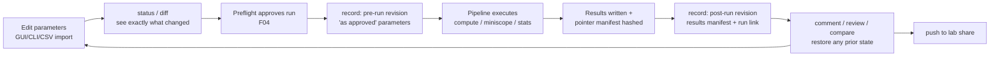

# EVC Implementation Plan — sequential integration of experiment version control

**Status:** approved working plan, 15 September 2026.
**Owner:** Elijah Keldsen (human decision owner, experiment version control).
**Companion:** [`experiment-version-control.md`](experiment-version-control.md) (architecture
and axioms). **Scope:** Comenius [F07 #76](https://github.com/emelon8/experiment_analysis/issues/76);
proposals for [D07 #93](https://github.com/emelon8/experiment_analysis/issues/93) and
[D08 #94](https://github.com/emelon8/experiment_analysis/issues/94); touches
[D05 #91](https://github.com/emelon8/experiment_analysis/issues/91) (config authority) and
[D06 #92](https://github.com/emelon8/experiment_analysis/issues/92) (data layout) where marked.

Phases are strictly sequential; each ends with a green test suite, a demoable behavior, and
an explicit acceptance check. No phase silently changes existing pipeline behavior:
version-control participation is **opt-in per experiment** until the team accepts D07/D08.

---

## 0. Ground truth (already merged at `1c32046`)

`aceneurotools.evc` core exists and is tested (35 tests): content-addressed SHA-256
objects (git header rule, byte-verified against `git hash-object`), zlib loose-object
store with integrity-checked reads, journaled compare-and-set refs, plumbing facade,
whole-directory worktree snapshot/materialize, JSON key-level diffs, notes-based
comments, fast-forward-only push to `LocalDirectoryRemote`, axiomatic porcelain
(`record/status/history/show/diff/restore/comment/recover/push`), CLI
(`python -m aceneurotools.evc`).

**Invariants that every later phase must preserve** (tested; do not weaken):
restore never destroys and never rewinds refs · every ref move is journaled ·
objects immutable + integrity-checked · push fast-forward-only · comments never
rewrite history.

---

## 1. Target workflow (what we are building toward)

The researcher-facing loop, GUI and CLI identical (ADR 0001):



Provenance chain this yields: **revision id → exact parameter tree → run record →
result checksums**, and in reverse: any figure traces back to the parameters that
produced it. Restoring old settings is `restore <rev>` + `record`; nothing is ever
overwritten.

---

## 2. Integration principle: adapters around the core, never core edits

The `evc` core stays pipeline-agnostic and pure-stdlib. All AceNeuroTools coupling
lives in **one new integration module per concern**, each replaceable without touching
the others:

```
aceneurotools/evc/                  (core — frozen API, changes only via this plan)
aceneurotools/evc/pointers.py       Phase 2: large-artifact pointer manifests
aceneurotools/evc/workspace.py      Phase 1: ExperimentWorkspace (what gets versioned)
aceneurotools/evc/hooks.py          Phase 3: RunRecorder — pipeline lifecycle observer
aceneurotools/evc/csv_bridge.py     Phase 4: experiments.csv / configs ⇄ workspace
aceneurotools/evc/sync.py           Phase 6: fetch/pull + Remote backends beyond local
```

Pipelines never import plumbing; they receive an optional `RunRecorder` (dependency
injection). If it is `None`, behavior is byte-identical to today — that is the
compatibility contract until D07/D08 are accepted.

---

## 3. Phases

### Phase 1 — Experiment workspace contract (`workspace.py`)

**Problem:** v0 versions "whatever files are in the directory." Real experiments mix
tracked state (parameters, configs, manifests) with untracked bulk (raw `.avi`,
`.rhd`, memmaps, `saved_movies/`).

**Deliverables**
1. `ExperimentWorkspace` — owns an experiment directory with a defined layout:
   `parameters/` (versioned), `results/<run-id>/manifest.json` (versioned),
   `artifacts/` and any raw-data paths (never versioned).
2. Ignore policy moves from `WorkingTree`'s hardcoded set to a declarative
   `.evc/ignore` file (one name/glob per line), created by `init` with safe defaults
   (`artifacts/`, `*.avi`, `*.hdf5`, `*.raw`, `*.mmap`, `saved_movies/`).
   `WorkingTree` gains glob support — its only change.
3. `ExperimentVersionControl.init` gains `workspace=True` mode that scaffolds the
   layout above.

**Acceptance:** a workspace with a 2 GB dummy `.avi` records in <1 s and the movie's
bytes never enter `.evc/objects`. **Tests:** ignore-glob unit tests; workspace
scaffold; snapshot-excludes-bulk. **Gate:** none (additive). **D06 note:** layout is
provisional until D06; `ExperimentWorkspace` is the single place it is encoded.

### Phase 2 — Result pointer manifests (`pointers.py`)

**Problem:** results (`meanFluorescence_*.npz`, `estimates.hdf5`, figures) must be
*provable* without being *stored* in history.

**Deliverables**
1. LFS-style pointer schema (JSON blob, versioned):
   `{"schema": "evc-pointer-v1", "sha256": ..., "size": ..., "relpath": ...,
   "created": ..., "producer": {"pipeline": ..., "revision": ...}}`.
2. `write_manifest(run_dir) -> manifest.json` — hashes every artifact in a run's
   output directory into one manifest; `verify_manifest(run_dir)` — re-hashes and
   reports missing/modified artifacts (the F06 provenance primitive).
3. CLI: `python -m aceneurotools.evc verify <run-id>`.

**Acceptance:** tamper with one artifact byte → `verify` names exactly that file.
**Tests:** manifest round-trip, tamper detection, empty-run manifest. **Gate:** none.

### Phase 3 — Pipeline hooks (`hooks.py`) — the surgical integration

**Problem:** revisions must happen at the two moments that matter — run approval and
run completion — without entangling pipelines with version control.

**Deliverables**
1. `RunRecorder` with exactly three lifecycle methods:
   - `on_run_approved(params: dict, config_paths) -> pre_rev` — serializes the
     *effective* parameters (post-precedence, the dict the pipeline will actually use)
     to `parameters/effective_run_params.json`, records **pre-run revision**
     (`message="run approved: <pipeline> line <N>"`).
   - `on_run_completed(run_dir, run_log) -> post_rev` — Phase 2 manifest + records
     **post-run revision**; writes both revision ids *into* `run_log.json`
     (keys `evc_pre_revision`, `evc_post_revision`).
   - `on_run_failed(error)` — journal entry only (op `run-failed`); no revision, no
     ref movement. Failed runs are visible in `recover`, never in `history`.
2. Wiring, one line per pipeline, all behind `recorder: RunRecorder | None = None`
   parameters: `ComputePipeline.run`, `MiniscopePipeline.run`, `StatsPipeline.run`
   (multimodal/ephys inherit via their composed pipelines later).
3. Opt-in switch: `lab_config.json` → `"run": {"history": true}`; `cli.py` builds the
   recorder only when enabled **and** the experiment directory has `.evc/`.

**Acceptance:** with history on, one compute+stats run yields exactly two revisions
whose ids appear in `run_log.json`; with history off (default), `git diff`-level
identical outputs to today and zero `.evc` reads/writes. **Tests:** recorder unit
tests with a stub pipeline; StatsPipeline integration test (fast, no caiman);
run-failure journaling; off-switch no-op test. **Gates:** D08 shapes *what else*
enters the pre-run tree (environment snapshot: package versions via
`importlib.metadata`, config file provenance) — implement the hook now, populate
per D08's outcome. **Fixes en route:** bug 3 from the 2026-09-15 audit (scatter
failures logged as completed) must be corrected here, or post-run revisions would
notarize false success — `record_complete` only on engine-reported success.

### Phase 4 — Configuration bridge (`csv_bridge.py`) — D05-gated

**Problem:** today's authoritative parameters live in shared CSVs
(`experiments.csv`, `analysis_parameters.csv`) and JSON configs outside the
experiment directory; the vision replaces raw CSV editing.

**Deliverables**
1. `extract(line_num, project) -> parameters/` — materializes the experiment's row
   slice (its experiments.csv row, its analysis_parameters row, relevant
   lab/stats-config sections) as canonical JSON files inside the workspace
   (`parameters/experiment.json`, `parameters/analysis.json`, `parameters/lab.json`).
   Deterministic key order; lossless round-trip.
2. `writeback(workspace) -> CSV rows` — inverse mapping, so existing CSV-driven
   pipelines keep working during migration (both directions unit-tested as a
   bijection on the template schemas; resolves the audit's template-mismatch bug 4
   as a precondition).
3. `import: on first extract, record "imported from CSV" as the root revision` —
   every experiment's history begins with a faithful copy of its legacy state.

**Acceptance:** extract → writeback reproduces the original rows byte-for-byte
(modulo defined whitespace canonicalization); editing `parameters/analysis.json` +
writeback is visible to `MiniscopePipeline` with no pipeline changes.
**Gate:** **D05 decides direction-of-truth** (CSV→JSON migration vs dual-write);
this phase builds the bridge both ways so either outcome is a config flip.

### Phase 5 — First-class CLI surface

**Deliverables:** `ace-neuro history <status|log|show|diff|restore|comment|push|verify>`
subcommand group in `cli.py`, delegating verbatim to the porcelain (no logic in the
CLI layer); `--experiment <line-num>` resolves the workspace via
`ExperimentDataManager`. Tutorial section in `docs/guides/` + notebook cell in the
generator. **Acceptance:** every porcelain command reachable from `ace-neuro` with
`--headless`-safe output; docs build. **Gate:** none (additive; D03 GUI work later
calls the same porcelain).

### Phase 6 — Sharing (`sync.py`) — D18/D19-gated

**Deliverables:** `fetch` + `pull --ff-only` (inverse of push; same object-walk,
mirrored); `clone` of an experiment from a share; `BoxRemote(Remote)` reusing
`shared/file_downloader` credentials (D19: transfers reviewed/explicit); project-level
`ace-neuro history overview` aggregating per-experiment heads read-only.
**Acceptance:** two checkouts exchange history through a share with divergence
surfacing as rejected push (never merged silently); Box path behind explicit consent
prompt. **Gate:** D18 for anything beyond reject-on-divergence; merge UX is
deliberately out of scope (format already supports it via multi-parent commits).

### Phase 7 — GUI readiness (hand-off, not GUI work)

**Deliverables:** freeze porcelain return types as the API contract (they are already
typed dataclasses: `RevisionInfo`, `StatusReport`, `RestoreResult`, `PushResult`,
`FileDiff/ParamChange`, `JournalEntry`); add `evc.api` re-export module +
docs/api/evc.md; property-based round-trip tests (hypothesis, dev-extra) over
objects/store as the long-term regression net. **Acceptance:** GUI team (D03) can
build screens from `docs/api/evc.md` alone. **Fulfills:** F07 acceptance
("compare revisions and restore settings without losing history") end-to-end.

---

## 4. Sequencing, size, and risk

| Phase | Depends on | Blocked by decision? | Size | Chief risk & mitigation |
| --- | --- | --- | --- | --- |
| 1 workspace | — | no (D06 informs) | S | layout churn → isolate in ExperimentWorkspace |
| 2 pointers | 1 | no | S | hash cost on huge files → stream + report timing |
| 3 hooks | 1–2 | D08 informs env snapshot | M | pipeline regressions → recorder=None default, off-switch test |
| 4 csv bridge | 1 | **D05** | M | schema drift → bijection tests on both templates |
| 5 CLI | 1–3 | no | S | UX churn → thin delegation only |
| 6 sync | 2–3 | **D18/D19** | M | divergence semantics → ff-only, reject loudly |
| 7 GUI hand-off | 3,5 | D03 (consumer) | S | API freeze too early → freeze at phase end, not before |

Rule of engagement per repo governance: phases 1–3 and 5 are implementable now under
F07's envelope; phases 4 and 6 land behind their decision gates. Every phase updates
`.comenius/AGENT_MEMORY.md` (tracker + work log), runs the full fast suite in the
caiman venv, ruff on touched files, and demos its acceptance check before the next
phase starts.

## 5. Non-goals (v1, explicit)

Merge/branch UX · storing raw recordings or movie bytes in history · rewriting or
deleting history (no force-push, no gc) · cloud execution · concurrent live editing
(D18) · replacing `run_log.json` (it is *linked from*, not replaced by, revisions).
