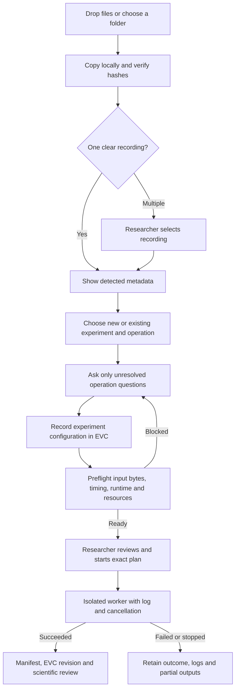

# Recording setup and execution

Authorized by Eli on 2026-09-17: implement a modular, object-oriented workflow
from dropped recordings through minimal, precise setup questions to local runs.
This branch implements that direction; it does not close the team's broader
Comenius decision issues.

## Contract

1. Drop files or a recording folder, or use the accessible file/folder picker.
   Browser imports stream copies to the local project; originals are untouched.
2. Inspect recording candidates using metadata and companion files. Display
   evidence and missing information. Never infer subject, treatment, or modality
   from a generic movie/raw-file extension.
3. Confirm a new or existing experiment, a recording, and the intended operation.
   Ask scientific questions only when required by that operation. Known values
   remain visible with their source; missing values are never fabricated.
4. Create an EVC experiment (or attach a new recording without replacing existing
   parameters). Raw files live under ignored `artifacts/`; small configuration,
   input hashes, answers and detection evidence are versioned.
5. Preflight the saved configuration and exact input bytes. Show parameters,
   checks, runtime, output location and limits. Changed inputs/settings invalidate
   the plan. A separate Run action approves this particular plan.
6. Execute one local worker, with visible stage/log output and cancellation.
   Each run has a unique directory. Successful results receive EVC manifests;
   failure, cancellation and interruption remain durable outcomes.



## Module boundaries

`gui/src/workflow/` owns browser file enumeration, upload transport, workflow
state and the Lumino panel. `gui/server/ace_workbench/workflow/` owns typed
contracts, bounded upload storage, detector strategies, conditional questions,
pipeline strategies, experiment setup, preflight and worker lifecycle.

The HTTP router is an adapter. Scientific code is imported only in a separate
worker; the GUI service remains usable without CaImAn. Existing EVC operations
remain the history implementation. Scientific readers receive isolated
per-run metadata adapters, rather than edits to a lab's original CSV registries.

## Scientific boundaries

Detection identifies a recording format, not experimental meaning. Multiple
recordings require selection; pairing/alignment is never assumed. CNMF-E needs
researcher-supplied indicator decay and spatial scale and review of extraction
thresholds. Extracted components are uncurated estimates. Ephys export preserves
signal units and acquisition timestamps. Generic trace CSV analysis requires
explicit time and signal units. Integrity inventory is labeled as an inspection,
not scientific processing. Unsupported/incomplete formats remain explainable.

## Researcher path

Start with `python3 gui/launch.py --project /path/to/project`. The project may be
empty. Supply `--runner-python /path/to/scientific/environment/bin/python` for
CNMF-E and ephys; this selects an existing environment and installs nothing.
The source checkout is explicitly supplied to that worker, so it executes the
same ACENeuroTools source as the GUI adapter. The old demo launcher also works
and discovers experiments created within its demo project on later launches.

Open **Import & Run** from the activity bar, Experiment menu or command palette.
A file/folder drop anywhere in the shell opens the workflow. Native file/folder
pickers are also provided. The browser sends local copies because it does not
expose arbitrary filesystem paths to the server. Uploads are sent as 1 MiB
chunks, with a 100 GiB / 10,000-file import limit and a 2 MiB saved-configuration
limit. Directory paths are preserved. `.DS_Store` is excluded; other invisible
or nonportable paths produce a clear rejection. Archives are not unpacked.

A paused copy can be resumed by reselecting the same files. Already stored chunks
must match byte-for-byte, preventing a changed source file from forming a hybrid
recording. Staged copies are explicitly discardable. Once attached, recordings
belong to the experiment; this workflow does not offer raw-data deletion.

### Required evidence and questions

| Input / operation | Evidence and validation | Questions that remain |
| --- | --- | --- |
| UCLA miniscope / CNMF-E | `metaData*.json`, one `timeStamps*.csv`, AVI segments in one recording folder; finite increasing frame numbers/times, consistent dimensions, movie/timestamp counts, rate agreement | Confirm calcium content if device metadata does not establish it; missing frame rate; indicator decay; neuron scale; seed thresholds and motion-correction choice |
| ONIX miniscope / CNMF-E | One `start-time_*_miniscope.csv`, matching `ucla-miniscope-v4-clock_*.raw`, AVI segments; explicit clock frequency, valid clock words, count/rate checks | Indicator decay; neuron scale; seed thresholds and motion-correction choice |
| Neuralynx / channel export | Neuralynx headers, `.ncs` channels, one `Events*.nev`; actual Neo header/channel validation | Which channel to export |
| RHS2116 / channel export | Matching `start-time_*.csv`, AC/DC/clock files; exact sample-count agreement and increasing hardware clock | Which channel to export |
| Numeric CSV / descriptive summary | Unique columns and numeric candidate row; complete-file finite-value, row-width and increasing-time validation at preflight | Signal unit; time column/unit if not explicitly named `time_s` or `time_ms` |
| Unknown/incomplete data / integrity inventory | Stored sizes and SHA-256 hashes | Experiment association; explicit choice of integrity inspection |

New/existing experiment association and the operation are always visible.
Multiple detected recordings require explicit selection. The setup names a unit
of work; it never claims to infer an animal, treatment, recording date or paired
session. The legacy `experiment.json` subject remains empty until a researcher
records it. Those attributes are not required for the implemented within-recording
operations; future group-comparison modules must request their required design
metadata rather than reuse this omission.

Known frame rates and explicit time-column units are shown with their source.
CNMF-E seed thresholds are reviewable starting values, not automatically fitted
scientific choices. Frame rates cannot silently fall back to 30 Hz. Irregular or
gapped calcium timing blocks extraction; trace summaries retain irregular timing
without resampling. A behavior-camera device marker blocks calcium processing.

### Run behavior and accuracy

Preflight hashes every copied input and validates the selected operation in its
actual worker environment. It records Python/package versions, a hash of the
scientific/workflow Python source, the current EVC revision, resolved timing,
effective settings, disk estimates and the destination. The run approval also
records its time and the local researcher identity. Plans expire after one
hour and can be used once. Changed tracked state invalidates a plan. Changed raw
bytes are rejected again by the worker before processing its verified private
snapshot. The visible Run action approves this particular plan.

CNMF-E reuses `MiniscopeProcessor` via a small headless recording adapter. Its
intermediate movie is TIFF, avoiding the legacy preprocessing AVI conversion.
No cropping, detrending, ΔF/F normalization, component acceptance or event
inference is silently applied. Deconvolution is disabled (`p=0`). The saved
CaImAn parameter file records the full resolved library configuration, and tests
check that supplied frame rate, decay, spatial scale and thresholds actually
reach the estimator. Spatial patches grow with the requested neuron scale.
Rigid motion correction is optional, with its shift limit visible in preflight.

Neuralynx uses the existing reader base with original hardware time enabled,
then exports the Neo segments directly; the legacy block interpolator is bypassed.
RHS uses its existing calibrated reader with automatic phase computation disabled.
Neither export truncates samples or fills gaps. Units and timing accompany the
export. Numeric CSV summaries use all rows and report count, mean, range and
sample standard deviation. Their preview contains only the first 500 samples.

These choices follow the dataset-specific parameter distinction in the
[CaImAn parameter documentation](https://caiman.readthedocs.io/en/latest/Getting_Started.html#parameters).
They do not establish biological validity or replace component quality review.
Browser folder enumeration drains every batch, as required by the
[directory-reader API](https://developer.mozilla.org/en-US/docs/Web/API/FileSystemDirectoryReader/readEntries);
its regression test includes more than 100 entries.

Only one local run executes at a time. The GUI remains responsive and shows
actual stage/log messages, without a fabricated percent-complete estimate. Cancel
terminates the owned process group on POSIX, escalating after five seconds. The
worker also exits if its parent server disappears. On reopening a project, an
unfinished durable job record becomes **interrupted**, never successful. Retry
means a new run with a new directory, not automatic continuation.

Successful output files receive an EVC pointer manifest and a new history
revision. Failed/cancelled runs retain logs and partial outputs without a success
manifest. GUI writes to the active experiment are blocked. An external CLI edit
can still occur; if it changes tracked state, finalization refuses to claim a
successful recorded result. No existing run directory is overwritten.

## Stored artifacts

```text
project/
  .ace-workbench/
    imports/<id>/import.json       upload state and immutable import evidence
    plans/                        preflight plans/checks/logs
    jobs/<run-id>.json             durable worker outcome
  experiment/
    parameters/experiment.json     EVC-tracked identity (unknown values explicit)
    parameters/workflow.<id>.json  EVC-tracked inputs, answers, effective settings
    artifacts/recordings/<id>/     copied source bytes; excluded from EVC blobs
    artifacts/recordings/<id>.import.json  portable import evidence
    artifacts/runs/<run-id>/       approved plan, private inputs, log, outcome
      outputs/                    results and runtime provenance
    results/<run-id>/manifest.json EVC-tracked output pointers
```

Raw data and intermediate files stay out of the EVC object store. Attaching to
an existing experiment requires a clean tracked state and an `artifacts/` ignore
rule. A failed pre-commit setup rolls back its new destinations and retains the
staged source. Explicit inputs, metadata and original lab CSV files are never
reorganized or overwritten in place.

## Extension points

- Add a `Detector` subclass in `detectors.py` (or a sibling module) that returns
  `Candidate` evidence, metadata and blockers. Register it in `DetectorRegistry`.
  Detection must be bounded and must not import the scientific stack.
- Add a `Pipeline` subclass defining supported formats, `Question` objects and
  deterministic effective settings. Register it in `PipelineRegistry`. The
  browser renders these fields without operation-specific form code.
- Add a `Runner` subclass with `check()` and `run()`; register its identifier in
  the worker's explicit `RUNNERS` table. Imports belong inside its methods.
  Use the existing scientific implementation where available. Never execute
  dropped scripts or dynamically import code selected by a recording.
- Test malformed/ambiguous inputs, missing metadata, settings reaching the
  estimator, actual generated-data output, stale-plan rejection and cancellation.
  An operation must fail visibly instead of silently discarding samples.

The registries are internal extension points, not an untrusted plugin loader.
No user-authored Python is executed through a format name or uploaded file.

## Verified scope and limits

Local verification uses generated data only: UCLA and ONIX calcium movies with
known timing/components, calibrated RHS samples, and a Neuralynx recording with
a deliberate gap and nonzero time origin. These exercise actual CaImAn/Neo
workers and EVC verification; they are not mocked runs. Acquired laboratory
recordings still need scientific acceptance testing. Full CNMF-E extraction is
not installed or tested in ordinary CI; its opt-in test command is in the README.

CSV inspection handles regular numeric tables, not arbitrary spreadsheets or
legacy experiment registries. This version processes one selected recording per
run and does not align multimodal recordings, run study statistics, curate cells,
resume partially completed scientific work, or provision a remote machine.
Resource estimates are lower bounds rather than performance guarantees. Native
Windows process-tree cancellation and non-Chromium browser folder behavior are
not validated. Existing result previews retain their 2 MiB / 500-row limits;
full outputs remain in the displayed run directory.
